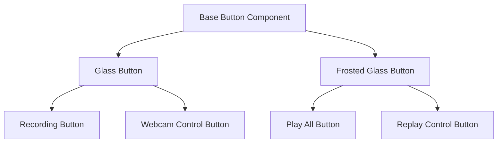

# Glass Button Design System

## Overview

This design document outlines the glass button design system for The Loft golf swing analysis application. The system provides a consistent approach to button styling with two distinct glass effects: standard glass buttons for webcam panels and frosted glass buttons for replay interfaces. This document details the visual design, component architecture, and implementation guidelines.

## Architecture

The glass button design system is built on a layered architecture:

1. **Base Styles**: Core CSS variables and utility classes that define the fundamental glass properties
2. **Style Functions**: JavaScript utility functions that compose glass styles for different contexts
3. **Button Components**: React components that implement the glass styles with appropriate behavior
4. **Context-Specific Variants**: Specialized button components for webcam panels and replay interfaces

### Component Hierarchy



## Components and Interfaces

### Base Glass Styles

The foundation of the glass button system is a set of shared glass styles that define the common properties:

```typescript
// Base glass style properties
export const glassStyles = {
  background: "bg-white/5",
  blur: "backdrop-blur-md",
  border: "border border-white/20",
  borderRadius: "rounded-sm",
  shadow: "shadow-[0_4px_24px_rgba(0,0,0,0.28)]",
  hover: "hover:bg-white/10",
  selected: "bg-white/15",
  buttonHover: "hover:!bg-white/10 hover:border-white/40 hover:shadow-[0_8px_32px_rgba(255,255,255,0.05)]",
  transition: "transition-all duration-300",
};

// Utility function to compose base glass styles
export const getBaseGlassStyles = () => {
  return `${glassStyles.background} ${glassStyles.blur} ${glassStyles.border} ${glassStyles.borderRadius} ${glassStyles.shadow} ${glassStyles.transition}`;
};
```

### Glass Button (Webcam Panel)

Glass buttons for webcam panels have a minimal, subtle appearance to avoid obscuring the video content:

```typescript
// Glass button for webcam panels
export interface GlassButtonProps extends ButtonProps {
  // Additional props specific to glass buttons
}

export function GlassButton({ className, ...props }: GlassButtonProps) {
  return (
    <Button
      variant="ghost"
      size="icon"
      className={cn(
        "z-10 h-10 w-10 transition-opacity duration-300",
        getBaseGlassStyles(),
        className
      )}
      {...props}
    />
  );
}
```

### Frosted Glass Button (Replay Interface)

Frosted glass buttons for replay interfaces have a richer texture and more pronounced visual presence:

```typescript
// Frosted glass button for replay interfaces
export interface FrostedGlassButtonProps extends ButtonProps {
  // Additional props specific to frosted glass buttons
}

export function FrostedGlassButton({ className, ...props }: FrostedGlassButtonProps) {
  return (
    <Button
      variant="ghost"
      size="icon"
      className={cn(
        "z-10 h-10 w-10 transition-opacity duration-600",
        "fancy-fill",
        getBaseGlassStyles(),
        "bg-blend-overlay",
        className
      )}
      {...props}
    />
  );
}
```

## Data Models

### Button State Model

The glass button system tracks several states that affect the visual appearance:

```typescript
type ButtonState = {
  isHovered: boolean;
  isActive: boolean;
  isDisabled: boolean;
  isSelected?: boolean;
};
```

### Theme Context

The glass button system adapts to the application's theme context:

```typescript
type ThemeMode = 'light' | 'dark';

interface ThemeContext {
  mode: ThemeMode;
  colors: {
    glassBackground: string;
    glassBorder: string;
    glassShadow: string;
  };
}
```

## Error Handling

The glass button system includes error handling for common issues:

1. **Missing Icons**: If an icon is not provided, the button will render with a fallback placeholder
2. **Accessibility Issues**: Warnings will be logged if buttons are missing required accessibility attributes
3. **Style Conflicts**: The system will detect and resolve conflicting style properties

## Testing Strategy

The glass button system will be tested using the following approaches:

1. **Unit Tests**: Test individual button components in isolation
2. **Visual Regression Tests**: Ensure consistent appearance across browsers and devices
3. **Accessibility Tests**: Verify WCAG compliance for all button variants
4. **Theme Tests**: Confirm proper rendering in both light and dark themes

## Design Decisions

### Why Two Button Types?

The decision to have two distinct button types (glass and frosted glass) was made to:

1. **Provide Visual Hierarchy**: Different button styles help users distinguish between different functional areas
2. **Optimize for Context**: Webcam panels need subtle controls that don't obscure video, while replay interfaces benefit from more prominent controls
3. **Maintain Consistency**: Having two well-defined button types prevents ad-hoc styling decisions

### Styling Approach

We chose to use Tailwind utility classes with a composition pattern because:

1. **Flexibility**: Allows for easy customization while maintaining consistency
2. **Performance**: Avoids runtime CSS-in-JS overhead
3. **Developer Experience**: Familiar pattern that aligns with the rest of the application

### Accessibility Considerations

The glass button system prioritizes accessibility by:

1. **Ensuring Contrast**: All buttons maintain sufficient contrast ratios for text and icons
2. **Supporting Keyboard Navigation**: All buttons are properly focusable and have visible focus states
3. **Providing ARIA Attributes**: Buttons include appropriate ARIA roles and labels

## Implementation Guidelines

### When to Use Glass Buttons

Use glass buttons when:
- The button is placed on a webcam panel
- The button needs to blend with video content
- The button is a secondary or tertiary action

### When to Use Frosted Glass Buttons

Use frosted glass buttons when:
- The button is placed on a replay interface
- The button is a primary action
- The button needs to stand out visually

### Customization Guidelines

When customizing glass buttons:
1. Preserve the core glass aesthetic (blur, transparency, subtle border)
2. Maintain consistent sizing (default: 40px × 40px)
3. Use appropriate icon sizes (default: 16px)
4. Ensure sufficient contrast for accessibility