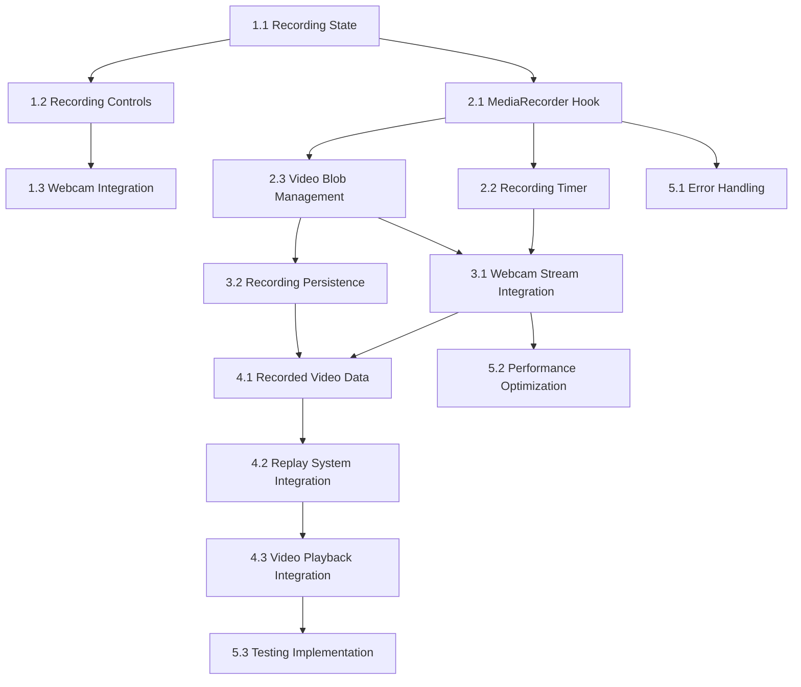

# Recording Implementation Tasks

## Phase 1: Foundation (✅ Complete)

### Task 1.1: Recording State Architecture
- **Status**: ✅ Complete
- **Description**: Create Jotai atoms for recording state management
- **Deliverables**:
  - [x] `recording-atom.ts` with RecordingState type
  - [x] `recordingStateAtomFamily` for per-panel state
  - [x] `readRecordingStateAtom` for read access
  - [x] `startRecordingAtom` for recording initiation
  - [x] `stopRecordingAtom` for recording completion
  - [x] `updateRecordingDurationAtom` for duration tracking
- **Files Created**: `src/lib/stores/recording-atom.ts`
- **Time Estimated**: 2 hours
- **Time Actual**: 1 hour

### Task 1.2: Recording Controls Components
- **Status**: ✅ Complete
- **Description**: Create UI components for recording controls
- **Deliverables**:
  - [x] `RecordingControls` component with state integration
  - [x] `RecordingButton` component with visual states
  - [x] Timer display during recording
  - [x] Consistent button dimensions matching camera dropdown
- **Files Created**: 
  - `src/components/recording-controls.tsx`
  - `src/components/recording-button.tsx`
- **Time Estimated**: 3 hours
- **Time Actual**: 2 hours

### Task 1.3: Webcam Panel Integration
- **Status**: ✅ Complete
- **Description**: Integrate recording controls into webcam panels
- **Deliverables**:
  - [x] Recording controls positioned in top-right corner
  - [x] Layout stability during recording state changes
  - [x] Consistent spacing with existing controls
- **Files Modified**: `src/components/webcam-panel.tsx`
- **Time Estimated**: 1 hour
- **Time Actual**: 0.5 hours

### Task 1.4: Documentation Foundation
- **Status**: ✅ Complete
- **Description**: Create comprehensive documentation for recording implementation
- **Deliverables**:
  - [x] `design.md` with architecture and visual design
  - [x] `requirements.md` with functional and non-functional requirements
  - [x] `tasks.md` with implementation roadmap
- **Files Created**: 
  - `src/docs/recording/design.md`
  - `src/docs/recording/requirements.md`
  - `src/docs/recording/tasks.md`
- **Time Estimated**: 4 hours
- **Time Actual**: 3 hours

## Phase 2: Core Recording (⏳ Pending)

### Task 2.1: MediaRecorder Hook Implementation
- **Status**: ⏳ Pending
- **Description**: Create custom hook for MediaRecorder API integration
- **Deliverables**:
  - [ ] `useMediaRecorder` hook with recording lifecycle
  - [ ] Error handling for recording failures
  - [ ] Browser compatibility detection
  - [ ] Recording format configuration (WebM/MP4)
- **Files to Create**: `src/lib/hooks/use-media-recorder.ts`
- **Dependencies**: Task 1.1 (recording atoms)
- **Time Estimated**: 6 hours
- **Acceptance Criteria**:
  - Hook manages MediaRecorder instance lifecycle
  - Handles start/stop/pause operations
  - Provides error states and recovery
  - Integrates with existing recording atoms

### Task 2.2: Recording Duration Timer
- **Status**: ⏳ Pending
- **Description**: Implement real-time duration tracking during recording
- **Deliverables**:
  - [ ] Timer hook for duration calculation
  - [ ] Integration with recording state atoms
  - [ ] Cleanup on recording stop/component unmount
- **Files to Create**: `src/lib/hooks/use-recording-timer.ts`
- **Dependencies**: Task 1.1 (recording atoms)
- **Time Estimated**: 2 hours
- **Acceptance Criteria**:
  - Accurate duration tracking in milliseconds
  - Efficient updates without performance impact
  - Proper cleanup to prevent memory leaks

### Task 2.3: Video Blob Management
- **Status**: ⏳ Pending
- **Description**: Handle recorded video blob storage and cleanup
- **Deliverables**:
  - [ ] Blob storage in recording state atoms
  - [ ] Automatic memory cleanup for old recordings
  - [ ] Video preview functionality
- **Files to Modify**: `src/lib/stores/recording-atom.ts`
- **Dependencies**: Task 2.1 (MediaRecorder hook)
- **Time Estimated**: 3 hours
- **Acceptance Criteria**:
  - Video blobs stored efficiently in state
  - Memory usage monitored and managed
  - Preview available immediately after recording

## Phase 3: Integration (⏳ Pending)

### Task 3.1: Webcam Stream Integration
- **Status**: ⏳ Pending
- **Description**: Connect MediaRecorder to webcam video streams
- **Deliverables**:
  - [ ] Stream capture from webcam components
  - [ ] Recording quality configuration
  - [ ] Audio recording toggle
- **Files to Modify**: 
  - `src/components/recording-controls.tsx`
  - `src/components/ui/webcam.tsx`
- **Dependencies**: Task 2.1 (MediaRecorder hook)
- **Time Estimated**: 4 hours
- **Acceptance Criteria**:
  - Records video from selected webcam
  - Maintains video quality during recording
  - Audio recording controllable per panel

### Task 3.2: Recording State Persistence
- **Status**: ⏳ Pending
- **Description**: Persist recording state and metadata
- **Deliverables**:
  - [ ] Recording metadata storage
  - [ ] Session recovery for interrupted recordings
  - [ ] Recording history tracking
- **Files to Create**: `src/lib/stores/recording-persistence.ts`
- **Dependencies**: Task 2.3 (video blob management)
- **Time Estimated**: 3 hours
- **Acceptance Criteria**:
  - Recording metadata persists across sessions
  - Recovery from unexpected interruptions
  - History accessible for replay integration

## Phase 4: Replay System Integration (⏳ Pending)

### Task 4.1: Recorded Video Data Structure
- **Status**: ⏳ Pending
- **Description**: Adapt recorded videos to replay system format
- **Deliverables**:
  - [ ] Convert recorded blobs to replay data format
  - [ ] Generate thumbnails for recorded videos
  - [ ] Metadata extraction (duration, timestamp)
- **Files to Create**: `src/lib/utils/recording-to-replay.ts`
- **Dependencies**: Task 2.3 (video blob management)
- **Time Estimated**: 3 hours
- **Acceptance Criteria**:
  - Recorded videos compatible with replay system
  - Automatic thumbnail generation
  - Consistent metadata format

### Task 4.2: Replay System Data Integration
- **Status**: ⏳ Pending
- **Description**: Replace dummy data with recorded videos
- **Deliverables**:
  - [ ] Update replay query to include recorded videos
  - [ ] Merge recorded and dummy data sources
  - [ ] Filter and sort functionality
- **Files to Modify**: 
  - `src/lib/hooks/use-replays.ts`
  - `src/lib/stores/replay-atom.ts`
- **Dependencies**: Task 4.1 (data structure)
- **Time Estimated**: 4 hours
- **Acceptance Criteria**:
  - Recorded videos appear in replay list
  - Proper sorting by recording date
  - Existing replay functionality preserved

### Task 4.3: Video Playback Integration
- **Status**: ⏳ Pending
- **Description**: Ensure recorded videos play correctly in replay system
- **Deliverables**:
  - [ ] Blob URL generation for playback
  - [ ] Video format compatibility testing
  - [ ] Playback controls integration
- **Files to Modify**: `src/components/replay-player-mini.tsx`
- **Dependencies**: Task 4.2 (data integration)
- **Time Estimated**: 2 hours
- **Acceptance Criteria**:
  - Recorded videos play without issues
  - All replay controls work correctly
  - Performance equivalent to dummy videos

## Phase 5: Quality & Polish (⏳ Pending)

### Task 5.1: Error Handling & Edge Cases
- **Status**: ⏳ Pending
- **Description**: Implement comprehensive error handling
- **Deliverables**:
  - [ ] Recording failure recovery
  - [ ] Permission denied handling
  - [ ] Storage quota exceeded handling
  - [ ] User-friendly error messages
- **Files to Create**: `src/lib/utils/recording-errors.ts`
- **Dependencies**: All Phase 2 tasks
- **Time Estimated**: 4 hours
- **Acceptance Criteria**:
  - Graceful handling of all recording errors
  - Clear user feedback for error states
  - Automatic recovery where possible

### Task 5.2: Performance Optimization
- **Status**: ⏳ Pending
- **Description**: Optimize recording performance and memory usage
- **Deliverables**:
  - [ ] Recording state update optimization
  - [ ] Memory leak prevention
  - [ ] Performance monitoring integration
- **Files to Modify**: Multiple recording-related files
- **Dependencies**: All Phase 2 and 3 tasks
- **Time Estimated**: 3 hours
- **Acceptance Criteria**:
  - No performance degradation during recording
  - Memory usage remains within limits
  - Efficient state updates

### Task 5.3: Testing Implementation
- **Status**: ⏳ Pending
- **Description**: Create comprehensive test suite
- **Deliverables**:
  - [ ] Unit tests for recording atoms
  - [ ] Component tests for recording controls
  - [ ] Integration tests for recording flow
  - [ ] Mock MediaRecorder for testing
- **Files to Create**: 
  - `src/lib/stores/__tests__/recording-atom.test.ts`
  - `src/components/__tests__/recording-controls.test.tsx`
  - `src/lib/hooks/__tests__/use-media-recorder.test.ts`
- **Dependencies**: All implementation tasks
- **Time Estimated**: 6 hours
- **Acceptance Criteria**:
  - 90%+ code coverage for recording features
  - All edge cases covered in tests
  - Reliable CI/CD pipeline integration

## Phase 6: Advanced Features (🔮 Future)

### Task 6.1: Recording Quality Settings
- **Status**: 🔮 Future
- **Description**: Add configurable recording quality options
- **Deliverables**:
  - [ ] Quality settings UI
  - [ ] Bitrate and resolution configuration
  - [ ] Format selection (WebM/MP4)
- **Time Estimated**: 5 hours

### Task 6.2: Export and Download
- **Status**: 🔮 Future
- **Description**: Enable export of recorded videos
- **Deliverables**:
  - [ ] Download functionality
  - [ ] Export format options
  - [ ] Bulk export capabilities
- **Time Estimated**: 4 hours

### Task 6.3: Cloud Storage Integration
- **Status**: 🔮 Future
- **Description**: Optional cloud storage for recordings
- **Deliverables**:
  - [ ] Cloud provider integration
  - [ ] Upload/sync functionality
  - [ ] Privacy controls
- **Time Estimated**: 12 hours

## Task Dependencies

## Risk Assessment

### High Risk Tasks
- **Task 2.1**: MediaRecorder API browser compatibility
- **Task 5.2**: Performance optimization under load
- **Task 4.2**: Replay system integration complexity

### Medium Risk Tasks
- **Task 3.1**: Webcam stream capture reliability
- **Task 5.1**: Comprehensive error handling
- **Task 5.3**: Testing MediaRecorder functionality

### Low Risk Tasks
- **Task 2.2**: Recording timer implementation
- **Task 4.1**: Data structure conversion
- **Task 4.3**: Video playback integration

## Success Metrics

### Phase 1 (✅ Complete)
- [x] Recording state atoms implemented
- [x] UI components created and integrated
- [x] Documentation completed
- [x] No TypeScript errors
- [x] Consistent visual design

### Phase 2 (Target)
- [ ] MediaRecorder hook functional
- [ ] Recording duration accurate
- [ ] Video blobs stored correctly
- [ ] Error handling implemented
- [ ] Performance benchmarks met

### Phase 3 (Target)
- [ ] Webcam recording functional
- [ ] Recording state persists
- [ ] Memory usage optimized
- [ ] All edge cases handled

### Phase 4 (Target)
- [ ] Recorded videos in replay system
- [ ] Playback functionality working
- [ ] Data migration seamless
- [ ] User experience consistent

## Timeline Estimate

- **Phase 1**: 6.5 hours (✅ Complete)
- **Phase 2**: 11 hours (⏳ Pending)
- **Phase 3**: 7 hours (⏳ Pending)
- **Phase 4**: 9 hours (⏳ Pending)
- **Phase 5**: 13 hours (⏳ Pending)
- **Total**: 46.5 hours

## Next Steps

1. **Immediate**: Begin Task 2.1 (MediaRecorder Hook Implementation)
2. **Short-term**: Complete Phase 2 (Core Recording)
3. **Medium-term**: Integrate with webcam streams (Phase 3)
4. **Long-term**: Connect to replay system (Phase 4)